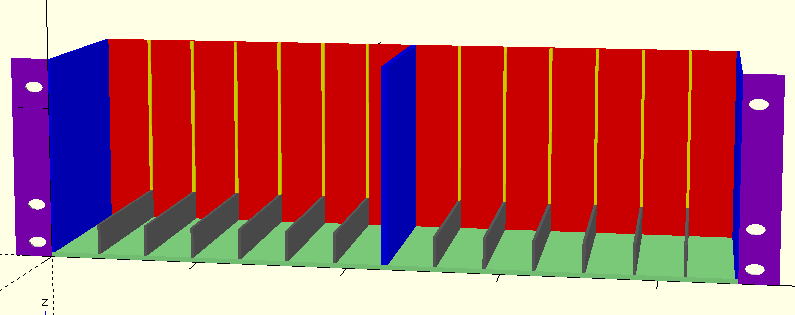
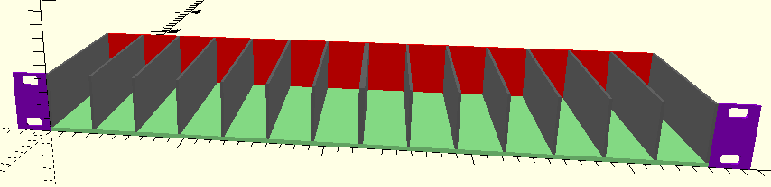

# 3D Printing Stuff
Various Models, tools, scripts, whatever.

* [LTO-Tape-Storage-3U](#LTO-Tape-Storage-3U)
* [LTO-Tape-Storage-1U](#LTO-Tape-Storage-1U)

## License (CC Attribution-ShareAlike 4.0 International (CC-BY-SA))

 This work by <a xmlns:cc="http://creativecommons.org/ns#" href="https://www.stum.de/" property="cc:attributionName" rel="cc:attributionURL">Michael Stum</a> is licensed under a <a rel="license" href="http://creativecommons.org/licenses/by-sa/4.0/">Creative Commons Attribution-ShareAlike 4.0 International License</a>.

## LTO-Tape-Storage-3U

A rack mountable storage unit for [LTO Tapes](https://en.wikipedia.org/wiki/Linear_Tape-Open). Holds 7 Tapes in a Half-Rack, two which form a full 14-Tape, 19", 3U Storage unit.

## LTO-Tape-Storage-1U

A 1U versdion of the LTO Tape Storage rack. Still needs about 3U in height with tapes in it, but uses only 1U worth of material.

Comes in 2 parts (left and right).

